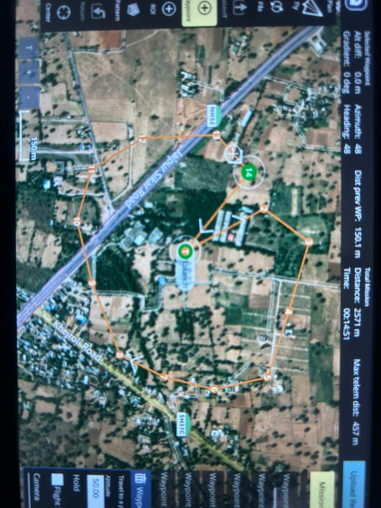
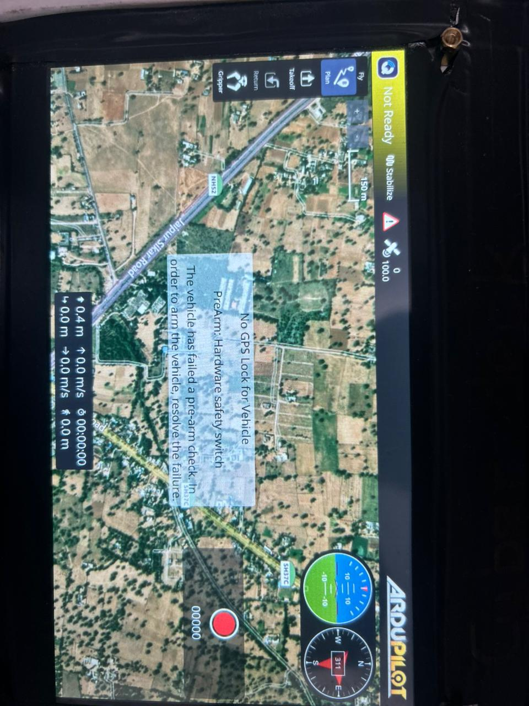

# SARTHAK – Smart Ariel Response & Tracking for Health And Kin-safety

SARTHAK is a drone-assisted disaster response system designed to help rescue teams quickly locate survivors and deliver emergency supplies in flood-affected or remote areas.

The system uses autonomous drones, computer vision, and a web-based control dashboard to monitor disaster zones, detect survivors, and deploy aid kits efficiently.

---

## Problem

During floods and disasters, rescue teams often face delays in locating survivors due to:

- Large disaster areas
- Limited visibility in forests or flooded regions
- Manual monitoring of drone camera feeds
- Communication failures

In many cases, survivors remain undetected for **hours or even days**, reducing the chances of survival.

---

## Solution

SARTHAK provides an integrated drone rescue system that can:

- Scan disaster zones autonomously
- Detect survivors using computer vision
- Display survivor locations on a live map
- Deploy supply drones to deliver emergency kits
- Provide real-time telemetry and monitoring

The goal is to **reduce rescue response time from hours to minutes**.

---
## SARTHAK

## Dashboard Preview

## Key Features

- Satellite disaster monitoring
- Drone swarm scanning
- Survivor detection markers
- Real-time drone telemetry
- Supply drone deployment
- Emergency voice announcement system
- Mobile-friendly command dashboard
- Automated disaster area navigation

---

## Technology Stack

### Hardware
- Drone Quadcopter Platform
- Pixhawk Flight Controller
- Raspberry Pi 4 (Onboard Computer)
- GPS Module
- Camera Module
- Servo Mechanism for Supply Drop
- LiPo Battery

### Software
- Python
- OpenCV
- MAVLink Communication Protocol
- ArduPilot Firmware

### Web Interface
- HTML
- CSS
- JavaScript
- Leaflet.js Mapping Library

---

## System Components

### 1. Drone Unit
Handles aerial scanning, navigation, and survivor detection.

### 2. Vision System
Processes camera feed using OpenCV to detect human presence.

### 3. Supply Drone
Deploys emergency kits to detected survivors.

### 4. Ground Control Dashboard
A web interface used by rescue teams to monitor drones and control missions.

---

## How It Works

1. The scanning drone patrols a disaster area.
2. The onboard camera captures live images.
3. The detection system identifies possible survivors.
4. The system marks the survivor location on the dashboard.
5. A supply drone is deployed to deliver emergency aid.
6. Rescue teams receive the coordinates for evacuation.

---

## Future Improvements

- AI-based survivor detection using deep learning
- Live drone video streaming
- Multi-drone coordination
- Integration with disaster response agencies
- Satellite flood detection integration

---

## Team

Project developed by Team **Phantompulse**

- Pankaj Kumar Saini
---(solo)

## Event

Developed for **ACEHack 5.0 Hackathon**

---

## Mission

To create a meaningful and intelligent drone-based rescue system that helps save lives during natural disasters.
